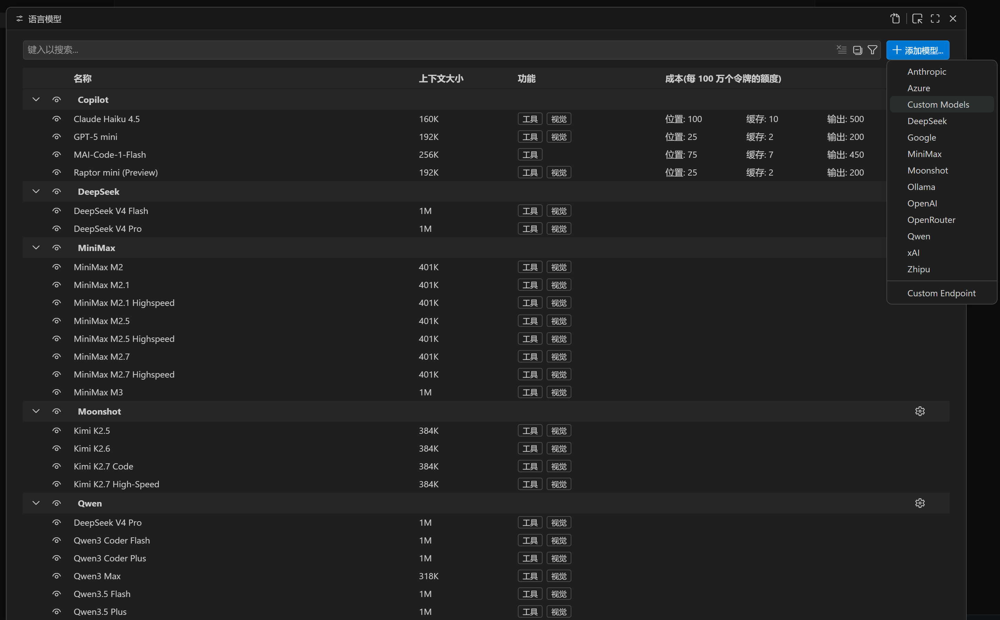
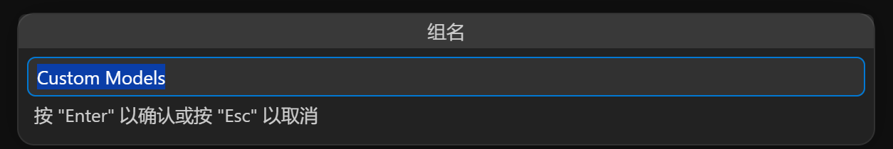
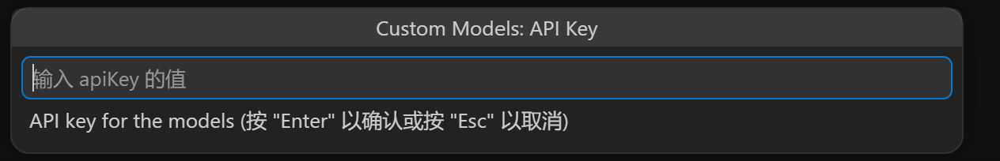
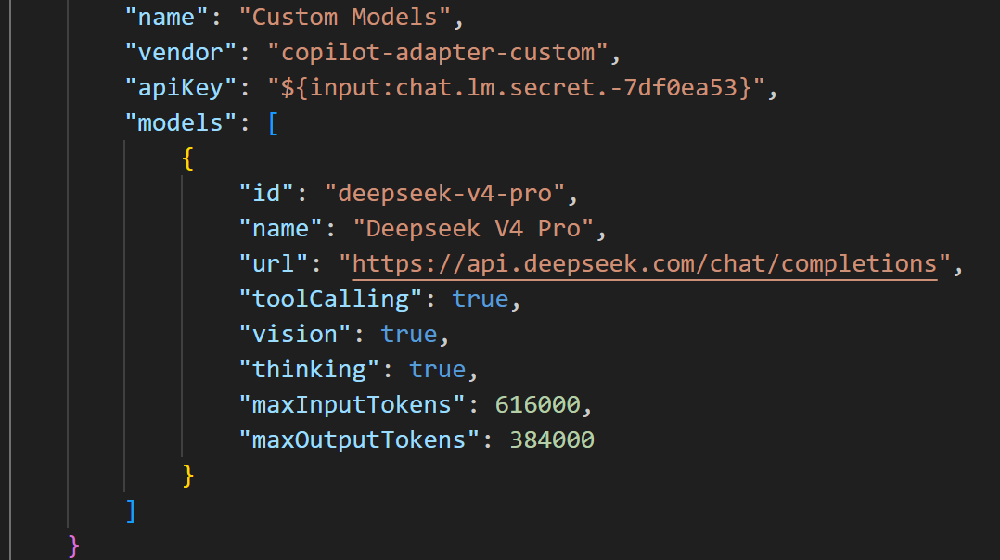
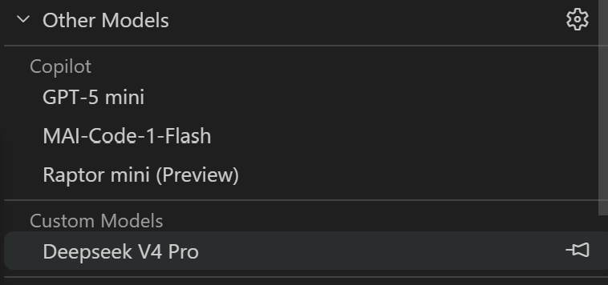
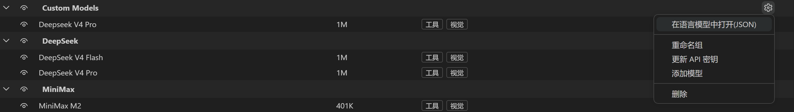

# 如何添加自定义模型

**Custom Models** 提供商允许你将任意兼容 OpenAI 接口的模型接入 Copilot Chat。
你只需在配置文件中定义模型的元数据（名称、端点、能力、token 限制）即可使用，无需编写代码。

---

## 第 1 步 打开语言模型面板

在模型管理面板或者通过 `Ctrl/Cmd+Shift+P` 输入 *语言模型* 打开面板。点击右上角的 **+ 添加模型…**，
从下拉菜单中选择 **Custom Models**。

---

## 第 2 步 输入分组名称和 API Key

弹出对话框要求填写**分组名称**（默认 "Custom Models"）和 **API Key**。
Key 会立即存入 VS Code Secret Storage，不会写入磁盘或任何配置文件。

---

## 第 3 步 在 `models` 数组中配置模型

JSON 文件会打开到正确位置。在 `"models"` 数组中添加一个或多个模型对象。
每个模型至少需要 `id`、`name`、`url`、`toolCalling`、`vision`、`maxInputTokens`、`maxOutputTokens`。

对于思考模型（`"thinking": true`），`"supportsReasoningEffort"` 字段为**选填**——
不填时扩展会根据模型 `id` 自动匹配预置配置。如需自定义选项、标签或请求体格式再填写。

> **提示：** 参考 [`custom-models-template.zh-cn.jsonc`](../docs/custom-models-template.zh-cn.jsonc)
> 获取可直接复制的模型配置模板，涵盖 DeepSeek、OpenAI、Anthropic、通义千问、智谱、MiniMax、Gemini、Grok 等。
---

## 第 4 步 自定义模型出现在模型选择器中

保存文件后，打开 Copilot Chat 模型选择器，你的自定义模型已出现在 **Custom Models** 分组下。
选择即可开始对话。

## 第 5 步 在当前自定义模型组增加模型或者编辑模型

在模型管理列表中，找到刚才添加的自定义模型组，点击右侧的齿轮图标，选择 **在语言模型中打开JSON**，即可在 `models` 数组中增加或编辑模型。

